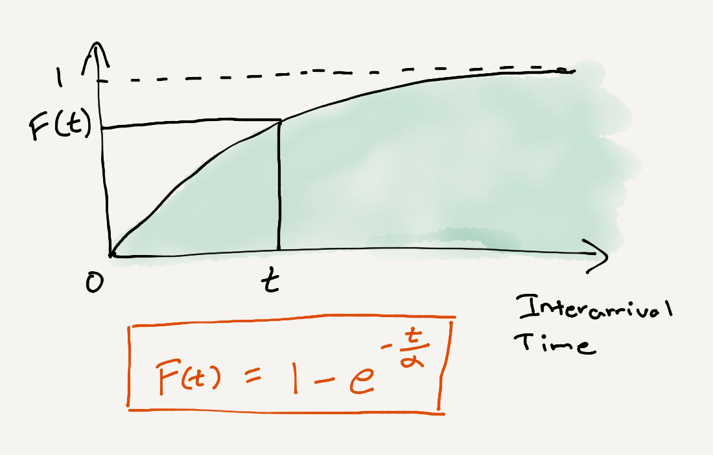
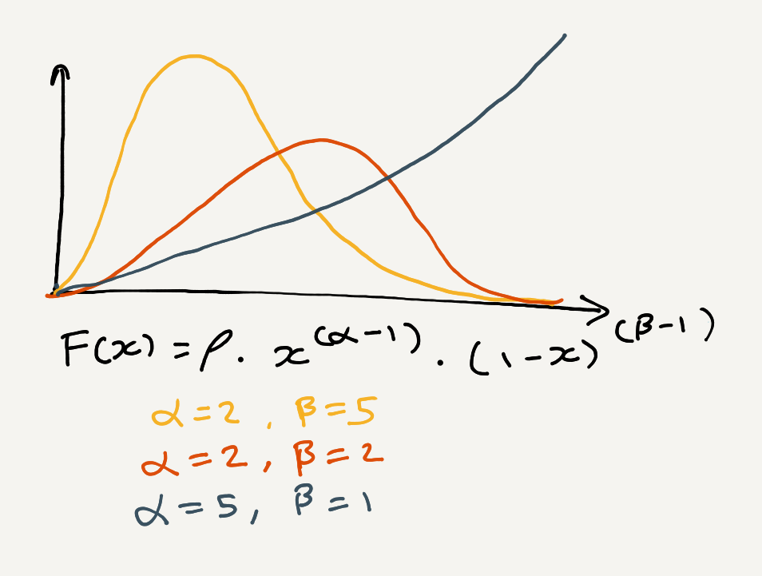

# Bank Simulation
In this exercise, we are going to explore your simulation capabilities. There will be some light math involved but the bulk of what we are looking for is your ability to model problems in code.

You are allowed and encouraged to search the internet for prior art and use any library that you deem helpful but please don't plagiarize the work of others. Some search terms that are relevant for this task: *Monte Carlo, Beta distributions, Critical-event technique, Time-slice method*

### Background

Our bank is a rather poor bank and can only afford one teller to man the station at any given time. Customers enter, seemingly at random and form a queue in front of the teller. The bank manager has tasked us to model this problem so he can get some answers. 

Here is the model for the probability for how customers arrive into the bank. This model assumes that customers arrive one at a time. `F(t)` gives us the probability that a customer arrives at any given `t` and this probability tends to `1` over time.  We can set the value of `𝛼 = 100` for  this simulation.



Given the seconds since the last customer arrived as `t` , this equation gives you the probability (between 0 and 1) that a customer arrives at this second. *Hint: See if you can rewrite this equation such that you only need to do one random number roll to get the answer*

As soon as a customer reaches the head of the queue, they are served by the teller. Since the problems of each customer can take a different amount of time to execute, we model this via a beta distribution like so:



You can assume the value of ρ = 200  . To get the processing time for the customer, generate a random value between 0 and 1 and set x to it. The result of the equation will be the time in seconds that this customer takes to process.

There are 3  different types of customers: yellow, red and blue, each of their time taken is modeled by the same equation but with different values of alpha and beta. You can assume that all customers coming in will be of the same type for any given simulation. 


### Task
Your task is to write a program that can outputs to stdout the answers to the following questions:

- Given only yellow customers, what are the average and maximum customer waiting times?
- Given only red customers, what are the average and maximum queue lengths in-front of the teller?
- Which type of customer(yellow, red or blue) gives the closest value between the average and maximum customer waiting times?

### Assumptions
- The time unit for the project is seconds
- The maximum number of customers is 500
  - this value was chosen simply because it allows me to get results in a timely fashion on my machine 
  - this value can easily be changed or passed through a configuration or as a command line argument 
- The customer arrival function has been interpreted as the likeliness (probability) of a customer reaching the office at a given time; hence, if that probability is greater than 0.5, the customer will reach the office at that time; otherwise, they won't
- The customer arrival function seems to prefer really large numbers
  - to cope with this, the maximum arrival time of a customer after another customer is limited to 3600 seconds (i.e. 1 hour)
  - even with this device, the results are of no particular interest (because a customer can still arrives - say - 2300 seconds after their predecessor, but the processing time is always a very small value - a handful of seconds)
- We convert Floats and Doubles into Ints
  - since these represents seconds, we believe that the loss of precision is not critical here
  - we convert a Float to its ceiling value; this is to prevent a number of seconds equal to 0; in other words, the conversion of a positive float (representing a number of seconds) will always give back at least 1 second
- Types could be improved (for instance, at the time of writing it is still possible to have a negative amount of seconds); however, since the program is pretty small and we are not exposing it as a library, we don't find this too big an issue
- While trying to avoid the most common mistakes, performance tuning was not the focus of this exercise


### Result

```
Given only yellow customers, what are the average and maximum customer waiting times?
- average customer waiting time: 0.0
- maximum customer waiting time: 0

Given only red customers, what are the average and maximum queue lengths in-front of the teller?
- average queue length: 0.0
- maximum queue length: 0

Which type of customer (yellow, red or blue) gives the closest value between the average and maximum customer waiting times?
Yellow
```